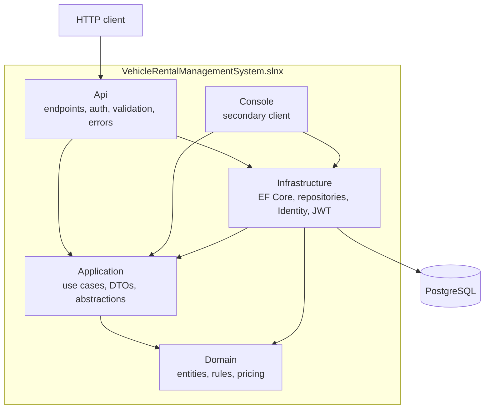
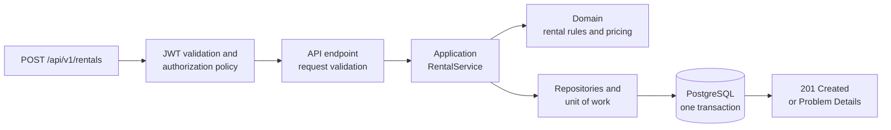

# Vehicle Rental Management System

[](https://github.com/sazzad-hossain-shafin/vehicle-rental-management-system/actions/workflows/ci.yml)

A production-style vehicle rental backend built with ASP.NET Core, EF Core and PostgreSQL. It demonstrates layered (Clean Architecture-style) design, a secured REST API with JWT authentication and role-based authorization, persistent rental history, Dockerized local development, an extensive automated test suite and a CI workflow.

> The project began as a small object-oriented console application and was progressively redesigned into a layered, persistent, authenticated and containerized backend. The Git history shows each step.

## Highlights

- **A customer website** (React, TypeScript): search availability for your dates, see the server's exact price, sign up, reserve, review and cancel reservations. Sessions use an HttpOnly cookie, so the token is never visible to page scripts. See [docs/frontend.md](docs/frontend.md).
- **Layered architecture** with strictly inward dependencies: Domain, Application, Infrastructure and an HTTP API. The Domain has no framework dependencies, and the Application layer has no EF Core or web dependencies.
- **PostgreSQL persistence** through EF Core with explicit migrations, unique business keys, protected rental history and a database rule that makes double-renting a vehicle impossible.
- **Authentication and authorization** with ASP.NET Core Identity, JWT bearer tokens, Admin/Staff/Customer roles, default-deny endpoints and customer ownership checks.
- **Reservations with a database-enforced no-double-booking guarantee**: customers reserve a vehicle for a date range. A PostgreSQL exclusion constraint stops overlapping reservations, and a per-vehicle row lock stops a walk-in rental and a reservation from racing each other, even across several API instances.
- **760 backend tests**, including tests that run the real HTTP pipeline against a real PostgreSQL database, and concurrency tests for double booking and double pickup.
- **One-command local environment** with Docker Compose: PostgreSQL, a one-shot migration job and the API.
- **CI workflow** for build, tests, vulnerability policy and Docker verification. It runs on GitHub Actions on every push and pull request (see [Continuous integration](#continuous-integration)).

## Technology

| Area | Technology |
|---|---|
| Language / runtime | C#, .NET 10 |
| Web | ASP.NET Core Minimal APIs, Problem Details (RFC 9457), OpenAPI with Scalar (Development only) |
| Data | Entity Framework Core 10, Npgsql, PostgreSQL 17 |
| Security | ASP.NET Core Identity, JWT Bearer authentication |
| Frontend | React 19, TypeScript (strict), Vite, React Router, TanStack Query, plain CSS design tokens |
| Testing | xUnit, Vitest and React Testing Library, Playwright |
| Operations | Docker, Docker Compose, GitHub Actions, Dependabot configuration |

## What it can do today

- **Vehicles:** add, look up (by id or registration number), list with paging and filters (type, maximum daily rate, availability). Browsing is public.
- **Customers:** register and look up customers; customers can also create their own account.
- **Rentals:** start a rental, return it, view the history. A vehicle can have only one active rental.
- **Reservations:** customers check which vehicles are free for a date range, reserve one for themselves, view and cancel their own bookings. Staff can book at the desk and pick a reservation up, which starts the rental at the quoted price. Details: [docs/reservations.md](docs/reservations.md).
- **Pricing:** strategy-based (normal, 10% promotional discount, 20% long-term discount for 7+ days). The price is calculated when the rental starts and stored on the rental, so history never changes when rates change.
- **Accounts:** sign in, register as a customer, admin-created staff accounts, and `/me` endpoints for a customer's own profile, rentals and reservations.
- **Operations:** paged lists, consistent Problem Details errors, readiness and liveness health endpoints, OpenAPI documentation.
- **Website:** a responsive customer site over the same API: browse and filter vehicles, availability by dates, an exact server-side quote, registration and sign-in, reserving, a reservations dashboard with cancellation, and an account page with rental history.
- **Console client:** a small text-menu client kept as a secondary demo.

## Architecture



Arrows point from a project to the projects it depends on. The Domain depends on nothing, and the Application layer defines the repository and unit-of-work abstractions that Infrastructure implements. The API is the composition root that wires them together.

| Project | Responsibility |
|---|---|
| `VehicleRental.Domain` | Entities (vehicle, customer, rental, reservation), enums, validation, lifecycles and pricing rules. |
| `VehicleRental.Application` | Use-case services, DTOs, repository and unit-of-work abstractions, paging. |
| `VehicleRental.Infrastructure` | EF Core mapping and migrations, repositories, Identity accounts, token issuing, database health check. |
| `VehicleRental.Api` | HTTP endpoints, authentication and authorization policies, error handling, OpenAPI, health checks. |
| `VehicleRental.Console` | Text-based demo client. |

How one request flows through the system:



More detail, including the operational view, is in [docs/architecture/overview.md](docs/architecture/overview.md).

### Notable engineering decisions

- **The price is stored on the rental** when it starts, so rate or policy changes can never rewrite history.
- **Pricing is chosen per rental** by a pricing policy in the rental use case, not stored as mutable state on the vehicle.
- **Migrations are explicit.** The API never changes the schema on startup; a separate migration job does.
- **Identity is separate from the domain `Customer`.** A nullable link column joins a login to a customer record, and the domain knows nothing about Identity.
- **The customer comes from the signed token**, never from an ID in the request. Another customer's rental answers 404, exactly like one that does not exist.
- **Double rental is prevented by the database**: optimistic concurrency on the PostgreSQL row version plus a partial unique index allowing one active rental per vehicle.
- **Double booking is prevented by the database too**: a PostgreSQL exclusion constraint on the vehicle and the half-open date range `[start, end)` refuses overlapping active reservations. The application checks first for a friendly message, but the constraint has the final say.
- **Rentals and reservations are serialised per vehicle** with a `SELECT ... FOR UPDATE` row lock taken before the availability check, so simultaneous requests (including through different API instances) cannot both succeed. See [ADR 005](docs/architecture/005-vehicle-booking-lock.md).
- **A reservation is not a rental.** It holds dates and a price quote without changing the vehicle's status; pickup converts it into a rental in one transaction, at the quoted price.
- **No EF Core types leak into the Application layer.**

See [ADR 001](docs/architecture/001-postgresql-persistence.md), [ADR 002](docs/architecture/002-docker-development-environment.md), [ADR 003](docs/architecture/003-authentication-and-authorization.md), [ADR 004](docs/architecture/004-reservations.md) and [ADR 005](docs/architecture/005-vehicle-booking-lock.md).

## Quick start (Docker)

Requires [Docker](https://www.docker.com/products/docker-desktop/) with Compose v2 and a running engine. No .NET SDK or database is needed.

```bash
git clone https://github.com/sazzad-hossain-shafin/vehicle-rental-management-system.git
cd vehicle-rental-management-system

# 1. Create .env with freshly generated random secrets (git-ignored, never committed)
powershell -File scripts/init-env.ps1     # Windows
bash scripts/init-env.sh                  # Linux, macOS, Git Bash

# 2. Build and start PostgreSQL, the migration job and the API
docker compose up --build -d

# 3. Check that everything is healthy
docker compose ps
curl http://localhost:8080/health
```

Frontend work only? See [Running it](docs/frontend.md#running-it): `cd frontend && npm ci && npm start` opens the hot-reload site in your browser (it needs an API to show data; the page says so clearly when there is none).

Then open the website at <http://localhost:8081> and register an account to make a reservation, or open <http://localhost:8080/scalar/v1> for the interactive API reference. Sign in with `ADMIN_EMAIL` and `ADMIN_PASSWORD` from your generated `.env`, and use **Authorize** to paste the token. To run an end-to-end check against the running stack, use `bash scripts/smoke-test.sh`. To stop and delete everything including the database, use `docker compose down -v`.

The Docker setup is for local development: it serves plain HTTP on `127.0.0.1` and has no TLS or deployment configuration. Details: [docs/docker.md](docs/docker.md).

### Without Docker

You need the [.NET 10 SDK](https://dotnet.microsoft.com/download) and, to run the API or the database tests, a PostgreSQL server.

```bash
dotnet build VehicleRentalManagementSystem.slnx
dotnet test VehicleRentalManagementSystem.slnx      # database tests are skipped unless configured
dotnet run --project src/VehicleRental.Api
```

The connection string, signing key and migrations are described in [docs/development.md](docs/development.md).

## API overview

All routes are under `/api/v1`. The full list, conventions, paging and errors are in [docs/api.md](docs/api.md).

| Method | Route | Access |
|---|---|---|
| GET | `/vehicles` (paged; filters `vehicleType`, `maxDailyRate`, `availability`) | Public |
| POST | `/auth/login`, `/auth/register` | Public |
| GET | `/me`, `/me/customer`, `/me/rentals` | Signed in / Customer |
| GET | `/vehicles/availability?startDate=&endDate=` | Public |
| GET | `/vehicles/{id}/quote?startDate=&endDate=` | Public (price from the pricing policy, nothing reserved) |
| POST, DELETE | `/auth/session` | Public (browser sign-in / sign-out with an HttpOnly cookie) |
| POST, GET | `/me/reservations`, `/me/reservations/{id}` | Customer (own data only) |
| POST | `/me/reservations/{id}/cancel` | Customer (own, before the start date) |
| GET, POST | `/reservations`, `/reservations/{id}/cancel`, `/reservations/{id}/pickup` | Staff, Admin |
| POST | `/vehicles`, `/customers` | Staff, Admin |
| POST | `/rentals`, `/rentals/{id}/return` | Staff, Admin |
| GET | `/rentals`, `/rentals/{id}` | Staff, Admin; customers see only their own |
| POST | `/admin/staff` | Admin |

Example: start a rental. The server calculates the total and stores it.

```http
POST /api/v1/rentals
Authorization: Bearer <access token>

{ "vehicleId": "<vehicle id>", "customerId": "<customer id>", "rentalDays": 3, "promotionalDiscountRequested": false }
```
```json
{ "status": "Active", "billableDays": 3, "dailyRateAtRental": 60.00,
  "pricingDescription": "Normal pricing", "totalCost": 180.00, "...": "..." }
```

## Security

- **Accounts:** ASP.NET Core Identity. Password hashing, validation and lockout (5 failed attempts, 15 minutes) are Identity's; nothing is hashed by hand.
- **Browser sessions:** the website signs in through `POST /auth/session`, which sets the token as an HttpOnly, SameSite=Strict cookie (never readable by scripts, nothing in web storage); cookie-authenticated writes also need an anti-CSRF header, and the site is served same-origin so no CORS is enabled. Details: [ADR 006](docs/architecture/006-customer-website-and-cookie-session.md).
- **Tokens:** JWT bearer, signed with HMAC-SHA256, 30-minute lifetime, validated for signature, issuer, audience and expiry. The API refuses to start without a strong signing key.
- **Authorization:** Admin, Staff and Customer roles mapped to named policies. Every endpoint requires sign-in unless explicitly marked anonymous, and a test checks every mapped endpoint against the documented access matrix.
- **Ownership / IDOR protection:** customers can reach only their own data, using the customer ID from the signed token. A customer's reservation request has no customer field at all.
- **Secrets:** supplied through environment variables or user secrets. `.env` is git-ignored, and `.env.example` holds no values. Compose refuses to start without the required secrets.
- **Containers:** the API runs as a non-root user with a read-only filesystem, all Linux capabilities dropped and `no-new-privileges`. The API port is bound to `127.0.0.1`.
- **Health endpoints** return status only, never connection details. Unexpected errors return a generic body with no stack trace.

Not implemented yet: refresh tokens, multi-factor authentication, email verification and password reset, rate limiting, TLS, and production secret management or deployment. Details: [docs/authentication.md](docs/authentication.md).

## Testing

| Project | Tests | Covers |
|---|---:|---|
| Domain | 133 | Entity invariants, rental and reservation dates and lifecycles, pricing strategies and policy |
| Application | 156 | Use-case services (including availability, booking, cancellation and pickup) against in-memory fakes and a controlled clock |
| Infrastructure integration | 142 | EF mapping, migrations, constraints, the no-overlap exclusion constraint, concurrent booking and pickup races, Identity, on real PostgreSQL |
| API | 329 | HTTP contracts, Problem Details, authentication, role policies, customer ownership, the reservation flow, on real PostgreSQL |
| **Total** | **760** | **760 passed, 0 failed, 0 skipped** when PostgreSQL is available |

Without a configured database, the PostgreSQL-backed tests are skipped and the rest still run; CI fails if any test is skipped. To run them all, point `VEHICLERENTAL_TEST_CONNECTION` at a PostgreSQL server (see [docs/development.md](docs/development.md#database-integration-tests)). The tests create and drop their own databases.

The website has 95 unit and component tests (Vitest, React Testing Library) and 11 Playwright end-to-end tests that run against the real website, API and PostgreSQL with nothing mocked.

The Docker smoke test (`scripts/smoke-test.sh`) runs 48 end-to-end checks against the running Compose stack: health, public access, 401/403, customer isolation, a full rental, and the reservation flow (availability, quote, booking, overlap and adjacent dates, cancellation, desk booking and pickup) and the browser cookie session.

## Continuous integration

The GitHub Actions workflow in [.github/workflows/ci.yml](.github/workflows/ci.yml) runs on pull requests and pushes to `main` with read-only permissions and no repository secrets. It is designed to verify:

- repository hygiene (no secrets or build output tracked, pinned actions)
- restore, a Release build with warnings as errors and a whitespace format check
- a NuGet vulnerability policy (High and Critical fail; outdated packages do not)
- all tests against a PostgreSQL 17 service container, failing if any test is skipped
- the website: strict typecheck, ESLint, unit and component tests, the production build and `npm audit` (high or critical fails)
- Playwright end-to-end tests against the whole stack in Docker
- the Docker images, Compose startup, migration and the HTTP smoke test

**Status:** the workflow runs on GitHub-hosted runners; see the badge above and the [Actions tab](https://github.com/sazzad-hossain-shafin/vehicle-rental-management-system/actions). Its first hosted run found one real Linux-only defect (a culture-dependent pricing name), which was fixed. Changes to `main` go through pull requests with these checks required; see [docs/ci.md](docs/ci.md) and the [contributing workflow](docs/development.md#contributing-workflow).

## Repository layout

```
src/            Domain, Application, Infrastructure, Api and Console projects
frontend/       The customer website (React, TypeScript, Vite) with its unit tests and Playwright tests
tests/          Domain, Application, Infrastructure integration and API tests
docs/           API guide, authentication, Docker, CI, architecture notes and ADRs
scripts/        Environment setup, smoke test and CI helper scripts
.github/        GitHub Actions workflow and Dependabot configuration
Dockerfile, compose.yaml, .env.example     Container build and local environment
```

## Roadmap

Planned, not implemented:

- Reservation extras: payments or deposits, notifications, cancellation fees, automatic expiry of no-shows, and a staff calendar view
- Refresh tokens, email verification, password reset and MFA
- Staff and admin screens for the rental desk (the customer website exists; the desk still uses the API)
- Website deployment with TLS
- Observability (structured logging, metrics, tracing)
- Production deployment, TLS and secret management
- Container image scanning and signing

## Documentation

See the [documentation index](docs/README.md).

## License

Released under the [MIT License](LICENSE).
