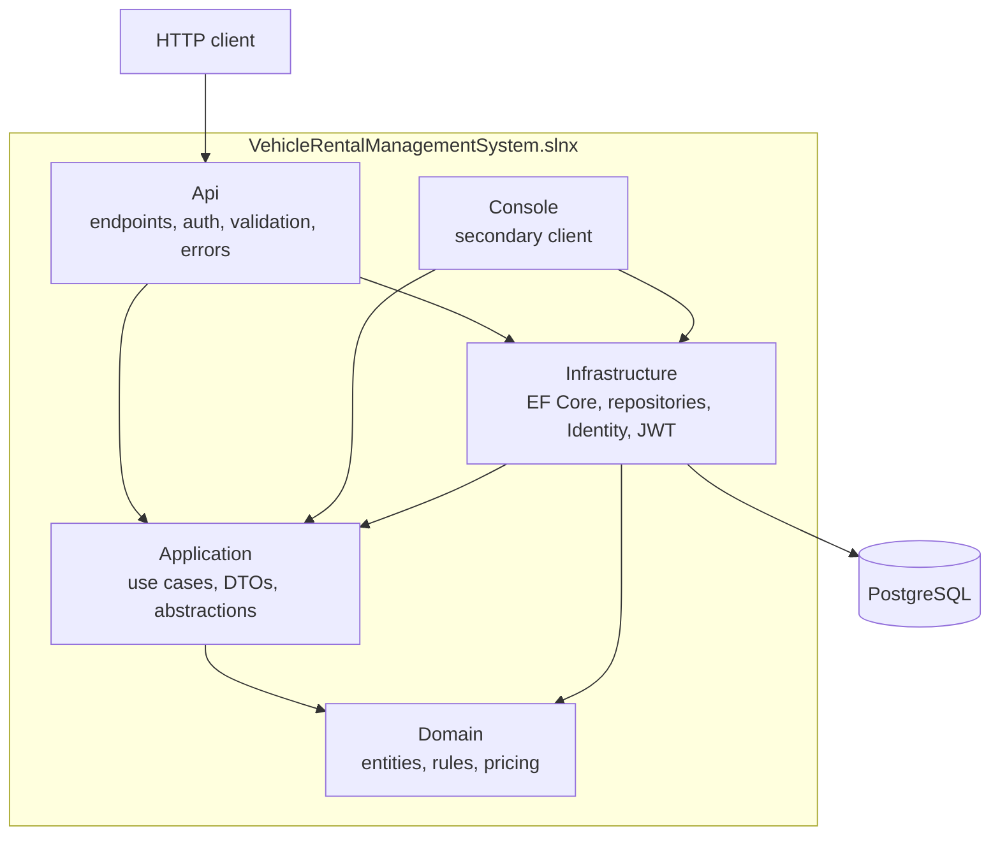
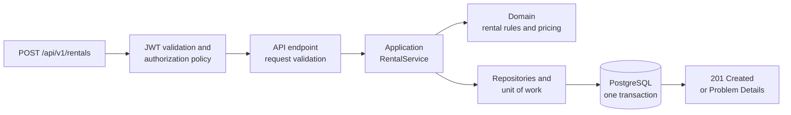

# Vehicle Rental Management System

A production-style vehicle rental backend built with ASP.NET Core, EF Core and PostgreSQL. It demonstrates layered (Clean Architecture-style) design, a secured REST API with JWT authentication and role-based authorization, persistent rental history, Dockerized local development, an extensive automated test suite and a CI workflow.

> The project began as a small object-oriented console application and was progressively redesigned into a layered, persistent, authenticated and containerized backend. The Git history shows each step.

## Highlights

- **Layered architecture** with strictly inward dependencies: Domain, Application, Infrastructure and an HTTP API. The Domain has no framework dependencies, and the Application layer has no EF Core or web dependencies.
- **PostgreSQL persistence** through EF Core with explicit migrations, unique business keys, protected rental history and a database rule that makes double-renting a vehicle impossible.
- **Authentication and authorization** with ASP.NET Core Identity, JWT bearer tokens, Admin/Staff/Customer roles, default-deny endpoints and customer ownership checks.
- **585 automated tests**, including tests that run the real HTTP pipeline against a real PostgreSQL database.
- **One-command local environment** with Docker Compose: PostgreSQL, a one-shot migration job and the API.
- **CI workflow** for build, tests, vulnerability policy and Docker verification. It is committed and validated locally but has **not yet run on GitHub** (see [Continuous integration](#continuous-integration)).

## Technology

| Area | Technology |
|---|---|
| Language / runtime | C#, .NET 10 |
| Web | ASP.NET Core Minimal APIs, Problem Details (RFC 9457), OpenAPI with Scalar (Development only) |
| Data | Entity Framework Core 10, Npgsql, PostgreSQL 17 |
| Security | ASP.NET Core Identity, JWT Bearer authentication |
| Testing | xUnit |
| Operations | Docker, Docker Compose, GitHub Actions, Dependabot configuration |

## What it can do today

- **Vehicles:** add, look up (by id or registration number), list with paging and filters (type, maximum daily rate, availability). Browsing is public.
- **Customers:** register and look up customers; customers can also create their own account.
- **Rentals:** start a rental, return it, view the history. A vehicle can have only one active rental.
- **Pricing:** strategy-based (normal, 10% promotional discount, 20% long-term discount for 7+ days). The price is calculated when the rental starts and stored on the rental, so history never changes when rates change.
- **Accounts:** sign in, register as a customer, admin-created staff accounts, and `/me` endpoints for a customer's own profile and rentals.
- **Operations:** paged lists, consistent Problem Details errors, readiness and liveness health endpoints, OpenAPI documentation.
- **Console client:** a small text-menu client kept as a secondary demo.

## Architecture



Arrows point from a project to the projects it depends on. The Domain depends on nothing, and the Application layer defines the repository and unit-of-work abstractions that Infrastructure implements. The API is the composition root that wires them together.

| Project | Responsibility |
|---|---|
| `VehicleRental.Domain` | Entities, enums, validation and pricing rules. |
| `VehicleRental.Application` | Use-case services, DTOs, repository and unit-of-work abstractions, paging. |
| `VehicleRental.Infrastructure` | EF Core mapping and migrations, repositories, Identity accounts, token issuing, database health check. |
| `VehicleRental.Api` | HTTP endpoints, authentication and authorization policies, error handling, OpenAPI, health checks. |
| `VehicleRental.Console` | Text-based demo client. |

How one request flows through the system:



More detail, including the operational view, is in [docs/architecture/overview.md](docs/architecture/overview.md).

### Notable engineering decisions

- **The price is stored on the rental** when it starts, so rate or policy changes can never rewrite history.
- **Pricing is chosen per rental** by a pricing policy in the rental use case, not stored as mutable state on the vehicle.
- **Migrations are explicit.** The API never changes the schema on startup; a separate migration job does.
- **Identity is separate from the domain `Customer`.** A nullable link column joins a login to a customer record, and the domain knows nothing about Identity.
- **The customer comes from the signed token**, never from an ID in the request. Another customer's rental answers 404, exactly like one that does not exist.
- **Double rental is prevented by the database**: optimistic concurrency on the PostgreSQL row version plus a partial unique index allowing one active rental per vehicle.
- **No EF Core types leak into the Application layer.**

See [ADR 001](docs/architecture/001-postgresql-persistence.md), [ADR 002](docs/architecture/002-docker-development-environment.md) and [ADR 003](docs/architecture/003-authentication-and-authorization.md).

## Quick start (Docker)

Requires [Docker](https://www.docker.com/products/docker-desktop/) with Compose v2 and a running engine. No .NET SDK or database is needed. From the repository root:

```bash
# 1. Create .env with freshly generated random secrets (git-ignored, never committed)
powershell -File scripts/init-env.ps1     # Windows
bash scripts/init-env.sh                  # Linux, macOS, Git Bash

# 2. Build and start PostgreSQL, the migration job and the API
docker compose up --build -d

# 3. Check that everything is healthy
docker compose ps
curl http://localhost:8080/health
```

Then open <http://localhost:8080/scalar/v1> for the interactive API reference. Sign in with `ADMIN_EMAIL` and `ADMIN_PASSWORD` from your generated `.env`, and use **Authorize** to paste the token. To run an end-to-end check against the running stack, use `bash scripts/smoke-test.sh`. To stop and delete everything including the database, use `docker compose down -v`.

The Docker setup is for local development: it serves plain HTTP on `127.0.0.1` and has no TLS or deployment configuration. Details: [docs/docker.md](docs/docker.md).

### Without Docker

You need the [.NET 10 SDK](https://dotnet.microsoft.com/download) and, to run the API or the database tests, a PostgreSQL server.

```bash
dotnet build VehicleRentalManagementSystem.slnx
dotnet test VehicleRentalManagementSystem.slnx      # database tests are skipped unless configured
dotnet run --project src/VehicleRental.Api
```

The connection string, signing key and migrations are described in [docs/development.md](docs/development.md).

## API overview

All routes are under `/api/v1`. The full list, conventions, paging and errors are in [docs/api.md](docs/api.md).

| Method | Route | Access |
|---|---|---|
| GET | `/vehicles` (paged; filters `vehicleType`, `maxDailyRate`, `availability`) | Public |
| POST | `/auth/login`, `/auth/register` | Public |
| GET | `/me`, `/me/customer`, `/me/rentals` | Signed in / Customer |
| POST | `/vehicles`, `/customers` | Staff, Admin |
| POST | `/rentals`, `/rentals/{id}/return` | Staff, Admin |
| GET | `/rentals`, `/rentals/{id}` | Staff, Admin; customers see only their own |
| POST | `/admin/staff` | Admin |

Example: start a rental. The server calculates the total and stores it.

```http
POST /api/v1/rentals
Authorization: Bearer <access token>

{ "vehicleId": "<vehicle id>", "customerId": "<customer id>", "rentalDays": 3, "promotionalDiscountRequested": false }
```
```json
{ "status": "Active", "billableDays": 3, "dailyRateAtRental": 60.00,
  "pricingDescription": "Normal pricing", "totalCost": 180.00, "...": "..." }
```

## Security

- **Accounts:** ASP.NET Core Identity. Password hashing, validation and lockout (5 failed attempts, 15 minutes) are Identity's; nothing is hashed by hand.
- **Tokens:** JWT bearer, signed with HMAC-SHA256, 30-minute lifetime, validated for signature, issuer, audience and expiry. The API refuses to start without a strong signing key.
- **Authorization:** Admin, Staff and Customer roles mapped to named policies. Every endpoint requires sign-in unless explicitly marked anonymous, and a test checks every mapped endpoint against the documented access matrix.
- **Ownership / IDOR protection:** customers can reach only their own data, using the customer ID from the signed token.
- **Secrets:** supplied through environment variables or user secrets. `.env` is git-ignored, and `.env.example` holds no values. Compose refuses to start without the required secrets.
- **Containers:** the API runs as a non-root user with a read-only filesystem, all Linux capabilities dropped and `no-new-privileges`. The API port is bound to `127.0.0.1`.
- **Health endpoints** return status only, never connection details. Unexpected errors return a generic body with no stack trace.

Not implemented yet: refresh tokens, multi-factor authentication, email verification and password reset, rate limiting, TLS, and production secret management or deployment. Details: [docs/authentication.md](docs/authentication.md).

## Testing

| Project | Tests | Covers |
|---|---:|---|
| Domain | 92 | Entity invariants, rental dates, pricing strategies and policy |
| Application | 122 | Use-case services against in-memory fakes |
| Infrastructure integration | 111 | EF mapping, migrations, constraints, concurrency, Identity, on real PostgreSQL |
| API | 260 | HTTP contracts, Problem Details, authentication, role policies, customer ownership, on real PostgreSQL |
| **Total** | **585** | **585 passed, 0 failed, 0 skipped** when PostgreSQL is available |

Without a configured database, the 182 PostgreSQL-backed tests are skipped and the rest still run. To run them all, point `VEHICLERENTAL_TEST_CONNECTION` at a PostgreSQL server (see [docs/development.md](docs/development.md#database-integration-tests)). The tests create and drop their own databases.

The Docker smoke test (`scripts/smoke-test.sh`) runs 21 end-to-end checks against the running Compose stack: health, public access, 401/403, customer isolation and a full rental.

## Continuous integration

The GitHub Actions workflow in [.github/workflows/ci.yml](.github/workflows/ci.yml) runs on pull requests and pushes to `main` with read-only permissions and no repository secrets. It is designed to verify:

- repository hygiene (no secrets or build output tracked, pinned actions)
- restore, a Release build with warnings as errors and a whitespace format check
- a NuGet vulnerability policy (High and Critical fail; outdated packages do not)
- all tests against a PostgreSQL 17 service container, failing if any test is skipped
- the Docker images, Compose startup, migration and the HTTP smoke test

**Status:** the workflow is committed and its steps have been validated locally, but it has **not yet run on GitHub-hosted runners**. No green hosted run exists yet. See [docs/ci.md](docs/ci.md).

## Repository layout

```
src/            Domain, Application, Infrastructure, Api and Console projects
tests/          Domain, Application, Infrastructure integration and API tests
docs/           API guide, authentication, Docker, CI, architecture notes and ADRs
scripts/        Environment setup, smoke test and CI helper scripts
.github/        GitHub Actions workflow and Dependabot configuration
Dockerfile, compose.yaml, .env.example     Container build and local environment
```

## Roadmap

Planned, not implemented:

- Booking and reservation workflow, with availability calendar logic
- Refresh tokens, email verification, password reset and MFA
- A frontend client
- Observability (structured logging, metrics, tracing)
- Production deployment, TLS and secret management
- Container image scanning and signing

## Documentation

See the [documentation index](docs/README.md).

## License

Released under the [MIT License](LICENSE).
