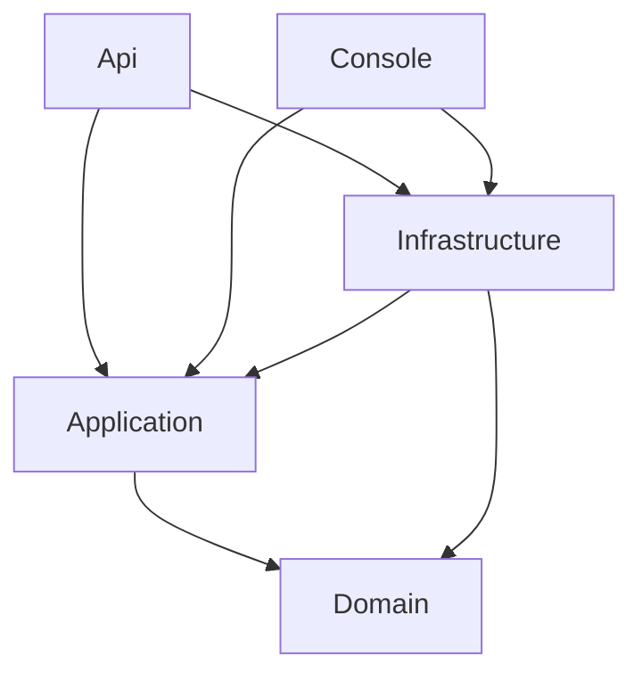
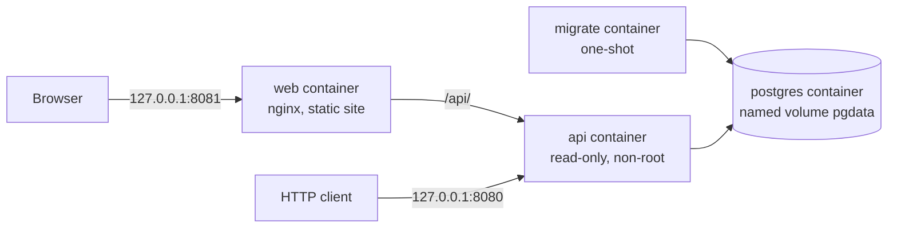
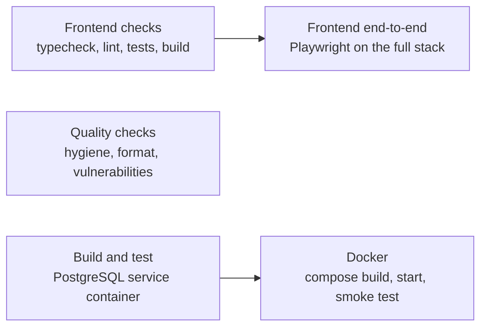

# Architecture overview

The solution is a set of .NET projects whose references point inward, toward the domain. Names below match the projects in `src/`.

## Dependencies

An arrow means "references". The Domain references nothing. The Application layer references only the Domain, plus dependency-injection abstractions. Infrastructure implements the Application layer's repository and unit-of-work interfaces, and the Api and Console projects are the entry points that wire implementations to interfaces.

| Layer | Owns | Must not contain |
|---|---|---|
| Domain | Entities (vehicle, customer, rental, reservation), validation, lifecycles, pricing strategies and policy | Framework, database or HTTP types |
| Application | Use-case services (vehicles, customers, rentals, reservations), DTOs, repository, availability-query and unit-of-work interfaces, paging, application errors | EF Core, Npgsql, ASP.NET Core |
| Infrastructure | EF Core mapping and migrations, repositories, Identity accounts, JWT issuing, database health check | Business rules |
| Api | Endpoints, request validation, authentication and authorization policies, Problem Details, OpenAPI | Business rules, data access |
| Console | A text-menu client for the same use cases | Business rules |

## Running system (Docker Compose)

The `web` container serves the React website and forwards `/api/` to the API, so a browser talks to one origin. The API port is still published separately.

PostgreSQL starts and becomes healthy, then the one-shot `migrate` service applies the EF Core migrations and exits, then the API starts. The API never changes the schema itself. See [Docker](../docker.md).

## Continuous integration

Quality checks, Build and test and Frontend checks run in parallel; the Docker job starts after Build and test, and the end-to-end job after Frontend checks. See [CI](../ci.md). The workflow runs on GitHub-hosted runners.

## Decision records

- [ADR 001: PostgreSQL persistence with EF Core](001-postgresql-persistence.md)
- [ADR 002: Docker development environment](002-docker-development-environment.md)
- [ADR 003: Authentication, authorization and customer ownership](003-authentication-and-authorization.md)
- [ADR 004: Reservations, date availability and pickup](004-reservations.md)
- [ADR 005: Serialising bookings of one vehicle with a row lock](005-vehicle-booking-lock.md)
- [ADR 006: Customer website and the HttpOnly cookie session](006-customer-website-and-cookie-session.md)
