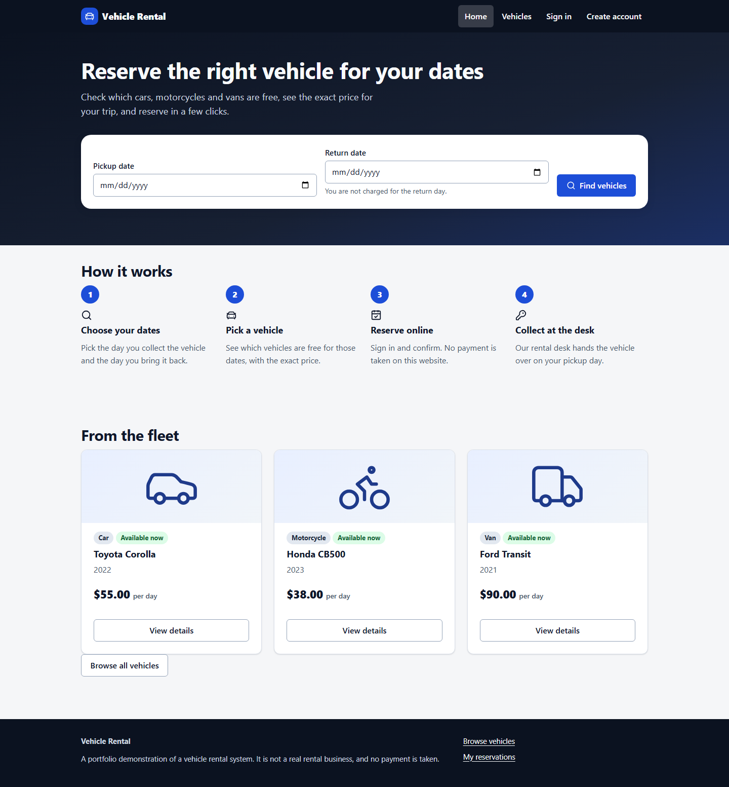
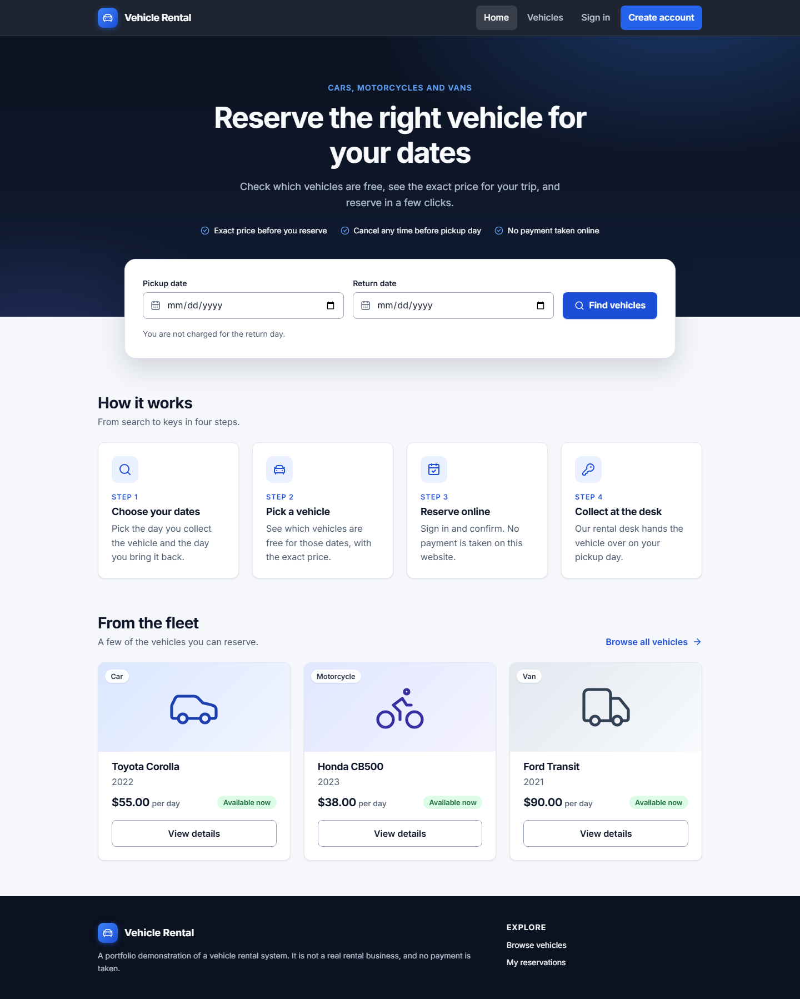
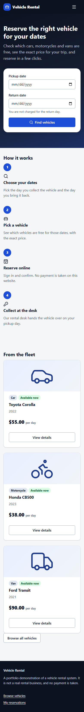
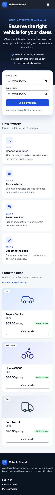
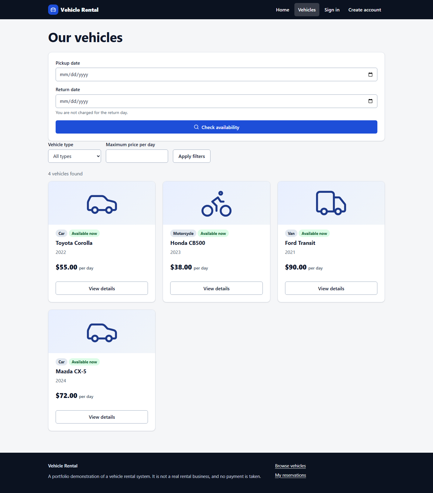
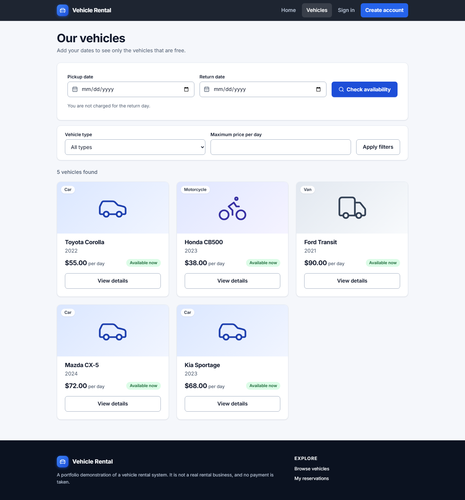
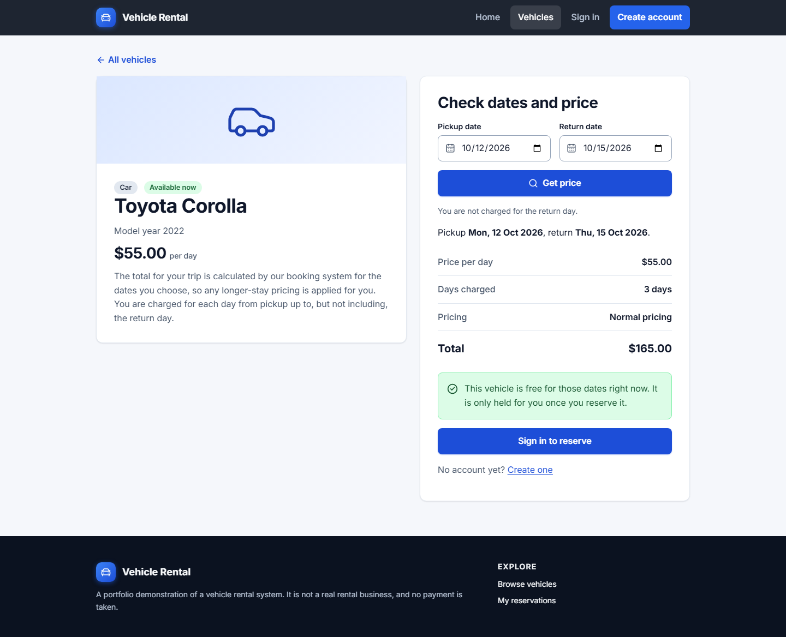
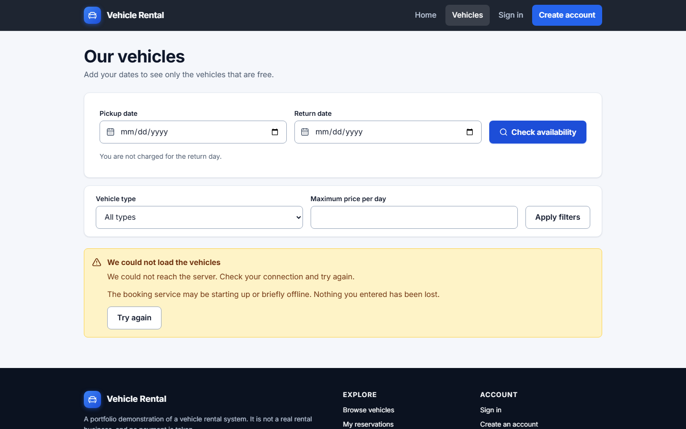

# Customer website

A React and TypeScript single-page app in [`frontend/`](../frontend). It is a customer-facing client of the existing API: it holds no business rules of its own. Availability, prices, discounts, date rules, ownership and conflicts are all decided by the API, and the pages only show what it returns.

## What it does

| Page | Route | Notes |
|---|---|---|
| Home | `/` | Date search, how it works, three vehicles from the API |
| Vehicles | `/vehicles` | Server-side paging and filters (type, maximum daily rate); with dates it lists only vehicles free for them |
| Vehicle details | `/vehicles/:id` | The vehicle, dates, and the server's exact price (`GET /vehicles/{id}/quote`); reserve button |
| Sign in / Create account | `/login`, `/register` | Cookie session, server validation errors shown next to fields |
| My reservations | `/reservations` | Paged list with status badges, including the API's "expired" flag |
| Reservation details | `/reservations/:id` | Stored quote, confirmation, cancel with a confirmation dialog |
| My account | `/account` | Profile and rental history (`/me/customer`, `/me/rentals`) |

Not built: payments (there is no payment concept in the API), staff or admin screens, vehicle photographs or specifications (the API has none; cards show an icon for the vehicle type), reviews or ratings.

## Running it

There are two ways to run the website. The pages show real data from the API, so a page that needs vehicles, prices or reservations only works when the API and PostgreSQL are running too. Without them the website still loads and shows a clear "we could not reach the server" message with a **Try again** button; it never shows made-up data.

### 1. Full application (website, API and PostgreSQL) in Docker

```bash
bash scripts/init-env.sh          # or scripts/init-env.ps1 on Windows; creates .env with random secrets
docker compose up --build -d
```

Open <http://localhost:8081> (set `WEB_PORT` in `.env` to change it). Compose starts PostgreSQL, applies the migrations, starts the API and then the website. An nginx container serves the built files and forwards `/api/` to the API, so the browser talks to one origin. The API is also published on `API_PORT` (default 8080); if something else on your machine already uses 8080, set `API_PORT=8090` in `.env`.

Check it is healthy with `docker compose ps` (every service `healthy`, `migrate` exited). The first vehicles are added by an administrator through the API; sign in with `ADMIN_EMAIL` and `ADMIN_PASSWORD` from `.env` (see the README).

### 2. Frontend only, with hot reload

Needs Node 24. From `frontend/`:

```bash
npm ci
npm start                         # or: npm run dev   (both start Vite on http://localhost:5173)
```

Both commands open the website in your default browser. The browser is **not** opened in CI, inside a Docker container, or when you opt out:

| To skip opening the browser | |
|---|---|
| `npm run dev:no-open` | Starts the same server without opening it |
| `NO_OPEN=1 npm start` | Same, through the environment (`$env:NO_OPEN=1` in PowerShell) |
| `CI=true`, or running in a container | Never opens a browser |

The dev server forwards `/api` to an API, which you start yourself:

- **API from Docker Compose:** `docker compose up -d postgres migrate api`, then point the dev server at it: `DEV_API_TARGET=http://localhost:8080 npm start` (use your `API_PORT`). In PowerShell: `$env:DEV_API_TARGET='http://localhost:8080'; npm start`.
- **API with `dotnet run`:** `dotnet run --project src/VehicleRental.Api` listens on `http://localhost:5270`, which is the dev server's default target, so no setting is needed. It still needs a reachable PostgreSQL and the user secrets described in the README.

If the target is not running you see one line in the terminal, `[api proxy] Cannot reach the API at … (ECONNREFUSED)`, and the pages show the "could not reach the server" message. That is the real failure surfaced, not hidden: start the API or fix `DEV_API_TARGET`.

`DEV_API_TARGET`, `NO_OPEN` and `CI` are read by the dev server only; nothing is bundled into the page. The only browser-side setting is the optional `VITE_API_BASE_PATH` (default `/api/v1`), which is public by nature. There are no secrets in the frontend.

Node 24 (the current LTS line) is pinned in `frontend/.nvmrc`, in `engines`, and in CI. TypeScript is held at 5.9 because the linting and OpenAPI tooling support that range.

## Scripts (in `frontend/`)

| Command | Purpose |
|---|---|
| `npm run typecheck` | Strict TypeScript |
| `npm run lint` | ESLint, including type-aware rules (no `any`, no floating promises) |
| `npm test` | Vitest and React Testing Library |
| `npm start` / `npm run dev` | Vite dev server with hot reload (opens the browser locally); `npm run dev:no-open` does not |
| `npm run build` | Typecheck and production bundle |
| `npm run e2e` | Playwright against a running stack (see below) |
| `npm run api:types` | Regenerate `src/lib/api/schema.d.ts` from the API's OpenAPI document |

## Structure

```text
frontend/src/
  app/                 router, layout (header, footer, mobile menu), providers
  components/ui/       Button, Field, Alert, Badge, Dialog, loading / empty / error states, Pagination
  features/auth/       session provider, sign in, register, protected routes
  features/vehicles/   home, list, details, date-range form, queries
  features/reservations/  reserve dialog, list, details and cancel, queries
  features/account/    profile and rentals
  lib/api/             the single HTTP client, error type, endpoint functions, generated schema
  lib/                 date and money helpers
  styles/              design tokens, base styles, components (plain CSS, no framework; Inter variable font bundled locally)
  test/                test setup and fake-API helpers
frontend/e2e/          Playwright tests
```

Server state is handled by TanStack Query, with no other global state library. API types come from the API's own OpenAPI document (`src/lib/api/schema.d.ts`, generated by `openapi-typescript`) and are narrowed once in `lib/api/normalize.ts`, which also converts numeric fields. Regenerate the types after changing an API contract: start the API in Development, then run `OPENAPI_URL=http://localhost:8080/openapi/v1.json npm run api:types`.

## Session design

See [authentication](authentication.md#browser-sessions) and [ADR 006](architecture/006-customer-website-and-cookie-session.md). In short:

- Sign-in calls `POST /api/v1/auth/session`. The server sets the access token as an **HttpOnly, SameSite=Strict cookie** scoped to `/api`, and the response contains only the account details and the expiry. JavaScript never sees the token, so it is neither stored nor logged by the app, and nothing is kept in `localStorage` or `sessionStorage`.
- Every state-changing request sends `X-Requested-With: VehicleRentalWeb`, which the API requires when a request is authenticated by the cookie (CSRF defence together with SameSite and the absence of CORS).
- After a reload the app calls `GET /me` to learn whether the cookie still identifies someone.
- The token lasts 30 minutes and cannot be refreshed or revoked. When the API answers 401 to a signed-in session, the app signs out locally, clears all cached customer data and shows "Your session ended" on the sign-in page.
- Signing out calls `DELETE /api/v1/auth/session` and then clears the query cache. Signing in as another account also clears it, so one customer's data is never shown to the next.

## Booking flow

1. The customer picks pickup and return dates. The return day is not charged, and the form says so. Dates are handled as calendar days (`yyyy-MM-dd` strings), never converted to local-time `Date` objects, so there are no off-by-one errors across time zones.
2. `GET /vehicles/availability` lists vehicles free for the period.
3. On a vehicle's page, `GET /vehicles/{id}/quote` returns the price from the server's pricing policy (including long-stay pricing) and whether the vehicle is free right now. This is a snapshot, not a hold.
4. Signed-out visitors are sent to sign in and come back to the same page. Staff accounts are told bookings are taken at the desk.
5. "Reserve these dates" opens a confirmation dialog with the quote. Confirming calls `POST /me/reservations` with the vehicle and dates only: no customer, price or status is sent.
6. On success the server's reservation is shown as the confirmation page. If someone else booked first, the API answers 409 and the dialog explains it and offers other dates or the other vehicles free for the same dates.
7. Queries for vehicles, quotes and reservations are invalidated after booking and cancelling, so availability is never served stale.

## Accessibility

Semantic landmarks and a skip link, labelled form fields with errors and hints linked by `aria-describedby`, `aria-invalid`, native `<dialog>` modals (focus trap, Escape, focus return), `aria-live` loading and error messages, descriptive link names, visible focus rings, a collapsing mobile menu with `aria-expanded`, and reduced-motion support. Colour pairs were chosen for at least AA contrast. This is an AA-aligned implementation; there has been no formal audit or certification.

## Testing

- **Unit and component tests** (`npm test`, Vitest and React Testing Library, fetch faked at the network boundary): the API client and error parsing, dates and date validation, response normalisation, UI states, forms, login and registration, protected routes, session expiry and cache clearing, vehicle list and filters, the quote, the reservation and 409 conflict flow, and cancellation.
- **End-to-end tests** (`npm run e2e`, Playwright, Chromium desktop and a phone viewport): run against the real website, API and PostgreSQL, with nothing mocked. They cover browsing, availability, the server price, registration, the HttpOnly cookie (not readable from the page, nothing in web storage), reserving, listing, cancelling, a real 409 race, protected-route redirects, account switching and the mobile menu.

To run the end-to-end tests locally against a disposable stack:

```bash
bash scripts/init-env.sh && docker compose up -d --build
cd frontend && npm ci && npx playwright install chromium
# the tests create vehicles with the admin account from .env
set -a; source ../.env; set +a
E2E_BASE_URL=http://localhost:8081 E2E_ADMIN_EMAIL="$ADMIN_EMAIL" E2E_ADMIN_PASSWORD="$ADMIN_PASSWORD" npm run e2e
```

Use a throwaway database: the tests create accounts, vehicles and reservations and do not remove them.

## Not done yet

Deployment (this runs locally in Docker only, over plain HTTP; production needs TLS and the `Session__ForceSecureCookie` setting), password reset and email verification, refresh tokens, staff screens, automated accessibility scanning, and screenshots (see [screenshots](screenshots.md)).

## Design system

Plain CSS with custom properties, no framework. `styles/tokens.css` defines the palette (deep navy surfaces, one blue accent, AA-checked status colours), a 4px spacing scale, a type scale, radii, shadows and motion. Inter (variable) is bundled from `@fontsource-variable/inter`, so no request leaves the site and the Content-Security-Policy stays `font-src 'self'`.

- **Breakpoints:** 40rem, 52rem and 72rem. They are written literally in media queries because CSS custom properties cannot be used in a media condition.
- **Motion:** 180 ms ease transitions on colour, shadow and a 2 px card lift; all of it is switched off by `prefers-reduced-motion`.
- **Accessibility:** skip link, a visible focus ring on every control, labelled fields linked to their hints and errors, native `<dialog>` for confirmations, status and alert roles for messages.
- **Imagery:** the API has no photographs, so vehicle cards show an original icon for the vehicle type. Nothing pretends to be a photo of the vehicle.

## Screenshots

| Before | After |
|---|---|
|  |  |
|  |  |
|  |  |

The vehicle page, and the page shown when the API cannot be reached:



