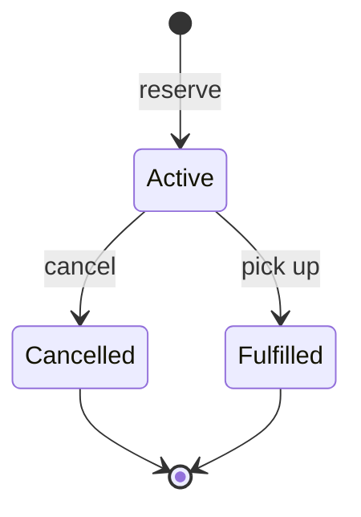

# Reservations

A **reservation** is a booking of one vehicle by one customer for a future date range, with a price quote. A **rental** is the vehicle actually checked out. A reservation does not change the vehicle's status; the vehicle is rented only when staff pick the reservation up, which starts a rental from it.

## Dates: the half-open interval `[startDate, endDate)`

The vehicle is held from `startDate` up to, but **not including**, `endDate`. A reservation from 1 Oct to 4 Oct holds the vehicle on 1, 2 and 3 Oct and has **3 billable days** (the same counting rentals use). So:

- a booking that **ends** on a day does not clash with one that **starts** on that day;
- the end date must be after the start date, so the shortest booking is one day;
- a booking cannot start in the past (today is allowed), more than 365 days ahead, or last longer than 90 days.

"Today" is the server's local date, the same clock rentals use.

## Lifecycle

Statuses are only changed through actions (`cancel`, `pickup`), never by sending a status. Cancelled and fulfilled are final.

- **Customer cancel:** only their own, and only before the start date. Once it has started, the rental desk cancels it.
- **Staff / admin cancel:** any active reservation.
- **Pickup:** staff / admin only, from the start date until the day before the end date.

## Price quote

When a reservation is made, the existing pricing policy chooses the strategy (normal, or long-term from 7 billable days; the optional promotion applies to short bookings and is available only at the desk). The daily rate, billable days, pricing description and total are stored on the reservation. Later changes to the vehicle's rate or to the pricing rules never change the quote, and the rental started at pickup uses the same quote. A customer booking never takes the promotion.

## Availability

A vehicle is **free for a period** when it has no active reservation overlapping the period and no active rental occupying it:

- Two periods overlap when `startA < endB` and `startB < endA`.
- An active rental occupies `[rental start, expected return)`. A rental that is overdue (not returned by its expected date) still has the vehicle out today, so it occupies at least today.
- This is separate from the vehicle's `Available` / `Rented` status, which says only whether the vehicle is out right now. A vehicle that is rented today can still be free for a later period.

`GET /api/v1/vehicles/availability` answers this in one SQL query (two `NOT EXISTS` conditions), with paging and the usual type and rate filters. A walk-in rental (`POST /api/v1/rentals`) is refused with 409 if the vehicle is reserved for any of its days.

## Customer flow

The [customer website](frontend.md) implements this flow end to end. Availability search and the price quote (`GET /vehicles/{id}/quote`) are public; reserving needs a sign-in.

1. `GET /api/v1/vehicles/availability?startDate=2026-11-10&endDate=2026-11-13` to find free vehicles.
2. `POST /api/v1/me/reservations` with `vehicleId`, `startDate`, `endDate`. There is no customer field: the customer is the signed-in one, taken from the token.
3. `GET /api/v1/me/reservations` and `GET /api/v1/me/reservations/{id}` to review. Another customer's reservation answers 404, exactly like one that does not exist.
4. `POST /api/v1/me/reservations/{id}/cancel` before the start date.

## Staff / admin flow

- `GET /api/v1/reservations` (optional `status`), `GET /api/v1/reservations/{id}`.
- `POST /api/v1/reservations` books at the desk for an existing customer (`customerId`, optionally `promotionalDiscountRequested`).
- `POST /api/v1/reservations/{id}/cancel`.
- `POST /api/v1/reservations/{id}/pickup` hands the vehicle over. In one database transaction it creates the rental (starting today, ending on the reservation's end date, at the reserved quote), marks the vehicle rented and marks the reservation fulfilled. If any part fails, nothing is saved. A pickup is refused (409) if the reservation is not active, today is outside its pickup window, or the vehicle has not been returned yet. Picking up later than the start date does not reprice or discount the booking.

## Expired reservations (no-shows)

A reservation that was never picked up stays `Active` after its period ends; nothing changes its status in the background. It is reported with `isExpired: true` from the end date on (the same calendar day the vehicle becomes free), so staff can find and cancel it. An expired reservation cannot be picked up, cannot be cancelled by the customer (it has started), never blocks availability, and does not conflict with a booking or rental that starts on its end date. Its last pickup day is the day before the end date.

## Concurrency guarantees

- **No double booking.** The application checks availability to give a useful message, but the database decides: a PostgreSQL **exclusion constraint** (`EX_Reservations_NoOverlappingActive`) forbids two **active** reservations of one vehicle with overlapping ranges: `EXCLUDE USING gist ("VehicleId" WITH =, daterange("StartDate","EndDate",'[)') WITH &&) WHERE ("Status" = 'Active')`. Two simultaneous requests cannot both succeed; the loser gets a 409. Cancelled and fulfilled reservations no longer hold the vehicle.
- **One pickup.** A reservation's row version (`xmin`) and a unique index on the rental it created let exactly one concurrent pickup succeed; the others get a 409.
- **Rentals and reservations cannot race each other either.** They live in different tables, so a constraint cannot see both. Instead, every operation that creates a claim on a vehicle (a reservation or a walk-in rental) first takes a database row lock on that vehicle inside its transaction and only then checks availability. Bookings of one vehicle therefore run one after another, even across several API instances, and the second one sees the first one's result and gets a 409. The wait is bounded (5 seconds, then a 409 asking to try again), and bookings of different vehicles never wait for each other. See [ADR 005](architecture/005-vehicle-booking-lock.md).
- **Lost races are conflicts.** When several requests compete, PostgreSQL may abort a loser to break a deadlock; the API reports that as 409 ("changed by another request, try again") rather than as a server error. No database detail reaches the client.

The constraint needs the `btree_gist` extension (it lets a UUID be compared with `=` inside a GiST index). The migration runs `CREATE EXTENSION IF NOT EXISTS btree_gist`. The extension ships with PostgreSQL and is marked trusted, so the database owner can create it. It was verified on PostgreSQL 17.

## Limits and what is not guaranteed

- The rental-versus-reservation guarantee comes from the vehicle lock that the application takes, not from a single constraint (they are in different tables). It holds for everything that goes through the application. Reservation-versus-reservation overlap is also enforced by the exclusion constraint for SQL that bypasses the application; direct SQL that inserts a rental overlapping a reservation is not stopped.
- No-shows are not cancelled automatically. An active reservation whose end date has been reached (`isExpired: true` in the response) can no longer be picked up and holds no future day, because the period is half-open, so it never blocks a new booking or a walk-in rental. It simply stays in the list as `Active` until staff cancel it.
- No payments, deposits, notifications or cancellation fees.
- Reservation times of day and time zones are not modelled; everything is whole days in the server's local date.
